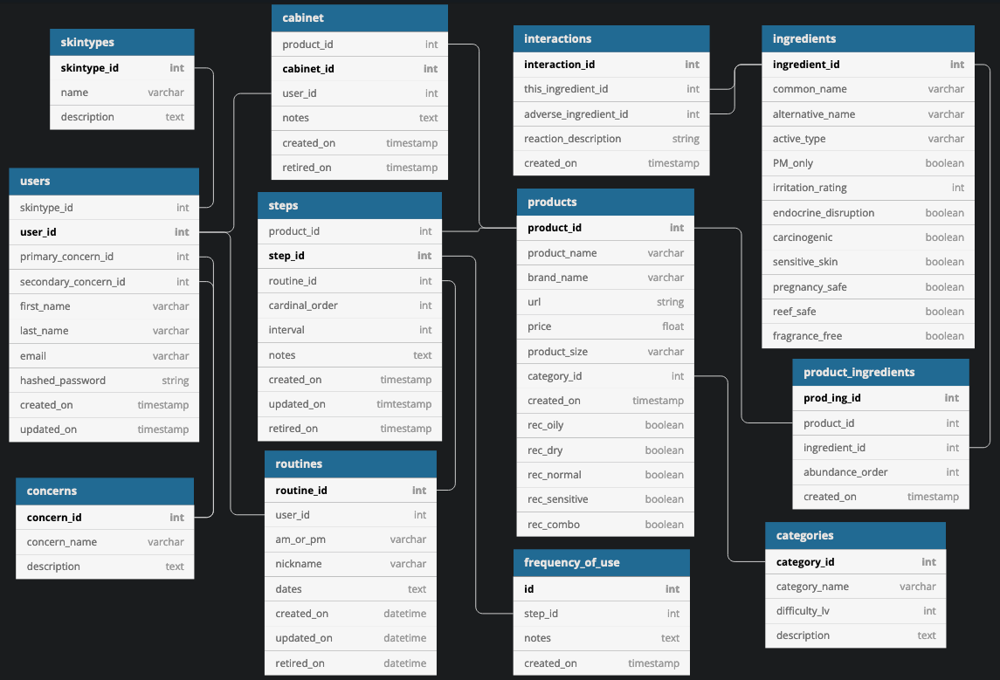
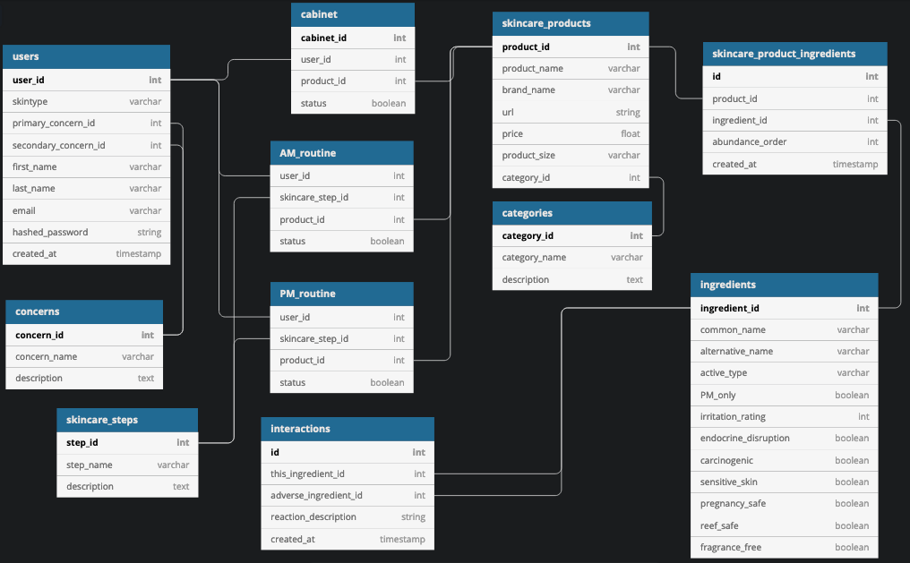
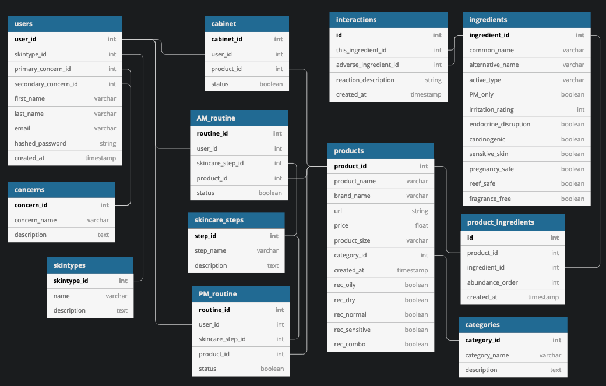
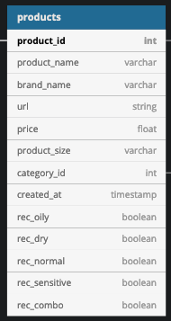

# THE SKINCARE ROUTINE HELPER


Check out the video demo on Youtube [here](https://youtu.be/iLkXraSDivw)!

## Table of Contents

1. [Overview](#overview)
   - [Datasets](#datasets)
   - [Tech Stack](#tech-stack)
2. [Features](#features)
3. [Knowledge Gained](#knowledge-gained)
   - [System Design](#system-design)
   - [Data Model](#data-model)
   - [Reasons](#reasons)
   - [Webscraping](#webscraping)
4. [Future Improvements](#future-improvements)
5. [Installation Instructions](#installation-instructions)
6. [Task List](#task-list)
7. [Journal Snippets](#journal)
8. [Disclaimer](#disclaimer)

## Overview

Did you know that the EU restricts 1,328 chemicals from cosmetics while the US restricts only 11? Or that in 2019, the FDA removed 14 of 16 sunscreen ingredients from its "generally safe and effective" category? How are we as consumers supposed to know which ingredients are helpful vs harmful? And how can we stay up to date on the latest scientific findings?

No worries, the Skincare Routine Helper is here!

The Skincare Routine Helper is an evidence-based app to help recommend skincare products and general skincare routines based on area of concern and ingredient safety.

Users can:

- search the product database and filter for products that are environmentally friendly, pregnancy-safe, fragrance-free, and more
- create and start a beginner-friendly skincare routine
- level up to more advanced routines consisting of multiple steps with a variety of different active ingredients (eg: niacinamides, vitamin C, and retinols)
- view safety data for ingredients based on recommendations from agencies like the World Health Organization and more
- view potential adverse reactions/interations between ingredients across multiple skincare products within a single routine

_[Click here](#the-skincare-routine-helper) to go back to the top._

### Datasets

View more details about the datasets used in this project by [clicking here](https://github.com/florating/skincare-routine-helper/blob/main/about/about_data.md).

<details><summary>Summary of the data and their sources</summary>

- Kaggle dataset of skincare products:
  - contains info about each product's ingredients, URL to purchase the product, and more
  - parsed using the `pandas` library and used to seed the database using custom Python scripts
- various skincare-related websites:
  - ingredient types, skintype-related recommendations, etc.
  - please see the [disclaimer](#disclaimer)!

</details>

_[Click here](#the-skincare-routine-helper) to go back to the top._

### Tech Stack

**Backend:** Python, Flask, Flask-Login, Werkzeug

- **Database:** SQL, PostgreSQL, SQLAlchemy, Flask-SQLAlchemy
- **Data cleanup/generation:** pandas, Mockaroo
- **Web scraping:** Beautiful Soup, ratelimiter

**Frontend:** HTML, CSS, Jinja, Javascript, jQuery, jQuery UI, Bootstrap

- **Data visualization:** D3.js
- **Image server:** Cloudinary

_[Click here](#the-skincare-routine-helper) to go back to the top._

## Features

- **Live querying** of the database upon typing into the search bar using JavaScript and AJAX

- Populate dropdown menus for routine creation and editing via AJAX and DOM manipulation using JavaScript and jQuery


- Database seeded using products and ingredients from a **Kaggle dataset** and users generated from [mockaroo](https://www.mockaroo.com/)

  - original Kaggle dataset [here](https://www.kaggle.com/eward96/skincare-products-and-their-ingredients)
  - cleaned Kaggle dataset [here](https://www.kaggle.com/eward96/skincare-products-clean-dataset)

- Images served from [Cloudinary](https://cloudinary.com), gathered via **webscraping metadata using Beautiful Soup**

- Visualized ingredient safety using D3.js, synthesizing data from the IARC, CSCP, CIR, Health Canada, and other government agencies

  - see About Data for more information

- A relational database (specifically PostgreSQL) with deferred columns, `@property` decorators to serialize the ORM classes, and custom mixins to handle timestamps and timezones

  - Utilized SQLAlchemy as the object-relational mapper to more easily query and manipulate data from the database

- Password security handled via [Werkzeug](https://werkzeug.palletsprojects.com/en/2.0.x/) using **salted SHA256 hashes**

_[Click here](#the-skincare-routine-helper) to go back to the top._

## Knowledge Gained

<details><summary>General thoughts to consider for future projects</summary>

- Create data model and system design diagrams
  - Consider how flexible each component should be. Do we need to scale up?
  - Is this an over-optimization that could be avoided? (Some things like indexing the database and caching can be helpful to speed things up when scaling up - but this may also needlessly complicate things. The code would also be more difficult to maintain.)
- Create user flow diagrams and wireframes when planning UX and UI design
  - In the future: work closely with UX and UI design, as this can change the architecture of the backend code significantly
- Be mindful of the objectives of each project when brainstorming to select datasets that make it easy to showcase specific project features (goals)
  - Silver lining: this was a great opportunity to learn how to programmatically webscrape to get product images, as those were not included in my datasets.
- Write effective and concise commit messages
- Be mindful of ergonomics!
- Use regular expressions to clean datasets and sanitize user input

</details>

### System Design


The Python server uses a Flask framework as the view engine to render HTML templates using Jinja. SQLAlchemy and Flask-SQLAlchemy allowed for the creation of ORM classes to provide an object-oriented approach to managing relationships within the relational PostgreSQL database. I added a custom `TimestampMixin` to these classes to allow me to handle the `created_on`, `updated_on`, and `retired_on` fields for each table and to convert aware UTC datetimes to Pacific Time for display purposes. I also added `@property` decorators to serialize data from within a single instance of an ORM class and to also leverage data by navigating the relationships within the database (particularly useful for listing ingredient names for each product in order of abundance).

#### Data Model

This version of the data model diagram was created on 10/25/21. There is a more updated version, which will be added soon.



Link: https://dbdiagram.io/d/615c95af825b5b0146228d67

<details><summary>Past versions</summary>

<details><summary>version 1 from 10/6/21</summary>



</details>

<details><summary>version 2 from 10/6/21</summary>



</details>

</details>

#### Reasons

1. Flask is lightweight, so it's great for building application prototypes.
   - pro: able to build features quickly
   - con: not as structured as larger frameworks like Django, but I'm not handling an unwieldy amount of data
2. Python has many libraries (like `pandas`) for data science-related tasks, like data cleanup/sanitization and analysis.
3. SQLAlchemy is the object relational mapper that allows for an object-oriented approach to handling data within the PostgreSQL database.
   - pros:
     - automatically sanitize input when querying the database (no parameter substitution required as would be required for raw SQL queries)
     - automate relationship management when seeding and updating rows in the database (cascade delete, etc.)
     - allows class inheritance as with any OO classes
     - abstraction
   - cons:
     - design data model and connect all of the pieces myself (actually was a great learning experience!)
     - somewhat slower calculations and queries when compared to raw SQL (but this is fine given that this project is not very large)
4. jQuery and jQuery UI for AJAX and DOM manipulation:
   - pros:
     - lightweight
     - more concise than vanilla JS for DOM manipulation
     - cross-browser compatibility with Chrome, Edge, Firefox, IE, Safari, Android, and iOS
   - cons:
     - not as modern as React or other libraries
     - slower than CSS and React (for animations and DOM manipulation, respectively)
   - note: I will be integrating more React into this project in the future; I was unable to do so during project season at Hackbright due to time constraints.

### Webscraping

The Kaggle dataset contained URL to a webpage where users can purchase the specific skincare product. (Presumably, the original person who created this dataset specifically scraped these webpages.)

After checking the website's robots.txt to confirm that scraping in this manner is not disallowed, product image URLs were scraped from metadata by visiting the product URLs. I used the Beautiful Soup and ratelimiter libraries in `meta.py` to automate this process. By limiting the requests to once per 20-30 seconds, I was able to respectfully access the website without taking up too much of their server's bandwidth. This also decreased the risk of detection and possible IP restriction or bans from server admin.

Image URLs were saved to CSV files, which were later accessed using scripts in `cloud.py` to upload them to Cloudinary in a rate-limited fashion. The returned image URL from Cloudinary was secured (uses HTTPS protocol) and saved in a CSV. I also simultaneously added the secured image URL to its respective product within the database by accessing the cloud_img_url field for the ORM class.

_[Click here](#the-skincare-routine-helper) to go back to the top._

## Future Improvements

- Look into improved encryption methods to hash and salt passwords
  - eg: `bcrypt` with a work factor of 10 or more and with a password limit of 72 bytes (source: [OWASP](https://cheatsheetseries.owasp.org/cheatsheets/Password_Storage_Cheat_Sheet.html))
- Setup one hot encoding using `pandas` to convert categorical data variables for future machine learning purposes to identify possible allergens
- Implement product recommendations via collaborative filtering
- Add form validation and further sanitize user input
  - Refer to OWASP principles for heightened security
- Explore using React components
- Look into more interactive data visualization opportunities (potentially to analyze ingredients live as users add them to their cabinets and skincare routines)

_[Click here](#the-skincare-routine-helper) to go back to the top._

## Installation Instructions

1. Setup the virtual environment and the script to load environment variables:

```bash
$ virtualenv env
$ source env/bin/activate
$ pip3 install -r requirements.txt

$ touch secrets.sh
```

2. Setup shell script for environment variables by writing this in `secrets.sh`:
   - **NOTE:** add to your `.gitignore` file and commit ASAP to preserve privacy

```bash
export CURRENT_DB_NAME="your_db_name"
export VALID_DB_NAMES="{'name_1', 'name_2'}"
export API_KEY="your_key_here"
```

3. Run the shell script (only need to do this once per session or whenever you edit this file):

```bash
$ source secrets.sh
```

4. Seed the database:

   - **Option 1:** use scripts

     - `python3 seed_db.py` to use the default setup text file
     - `python3 seed_db.py some_kind_of_setup_file.txt` to use a preset setup text file
       - Note: You can create your own text file and follow the format of the default text file in `/data/file_list.txt`. Name it whatever you want, and use that name instead of `some_kind_of_setup_file.txt`.

   - **Option 2:** load a sql file (read about your options [here](https://www.postgresql.org/docs/current/app-psql.html))

   ```bash
   $ psql your_db_name < your_db_file.sql
   ```

5. View contents of database:

   - **Option 1:** use PostgreSQL to play around with the data

   ```bash
   $ psql your_db_name
   ```

   - **Option 2:** use scripts to get a quick summary
     - Note: valid database names used during development include `project_test_2` and others listed within `db_info.py`

   ```bash
   $ cd database
   $ python3 db_info.py your_db_name
   ```

6. Save the database: `pg_dump your_db_name > your_db_file.sql`

_[Click here](#the-skincare-routine-helper) to go back to the top._

## Next Steps

- [ ] add product to user's cabinet from individual product details page
- [ ] fix up the D3 graph animations:
  - adjust the start point so the datapoints don't all come from the top left corner (they should come from the x=0 position, at the y-axis)
- [ ] add legend to the graph
- [ ] test that imports from nexted directories (added on 10/20/21) did not break anything
- [ ] add official hazard info to the ingredients within the ingredients table
  - [x] 10/24/21: review the CSCP product database
    - [ ] add to db
  - [x] review the IARC monographs of carcinogenic agents
    - last updated on 27 September 2021 (yay!)
    - [ ] add to db
- [ ] add additional skincare products
  - [ ] add more sunscreens
  - [ ] add extra products

<details><summary>Completed</summary>

- [x] request API keys
- [x] 10/14/21: add product to user's cabinet
  - [x] 10/14/21: from product results list
- [x] queries, joins, etc.
- [x] 10/19/21: display summary of database info on homepage (this takes nearly 1 min to load the page!)
  - [x] 10/22/21: setup CSV reader to display on homepage (now only takes a few seconds!)
  - [x] 10/22/21: setup data visualization with D3: horizontal lollipop histogram
    - [x] 10/22/21: animate graph
    - [x] 10/22/21: add ability to show two graphs with a button click and JS
- [x] add livesearch capability to old search forms
- [x] save a user's skincare routine to the db
  - [x] 10/24/21: update data model diagram
  - [x] implement data model changes to ORM classes
  - [x] re-seed the database
- [x] 10/20/21: setup imports from nested directories
- [x] 11/3/21: finish scraping image URLs for a basic skincare routine
  - [x] 11/8/21: upload to Cloudinary + save links to db

</details>

### Known Bugs

_These are known bugs in the project that will be tackled soon!_

**High priority:**

- unauthorized users are redirected to the GET request of the `login` view function on `server.py`
  - [ ] setup `@login_manager.unauthorized_handler` per [this resource](https://stackoverflow.com/questions/36269485/how-do-i-pass-through-the-next-url-with-flask-and-flask-login)
  - [x] 10/27/21: or temporarily route to the homepage

**General:**

- duplicate product entries appear in the database whenever a product is in the dataset for > 1 product size (eg: a mini version and a regular size)
  - interestingly, only 1 of these products has ingredients associated with it, likely due to the `create_ingredients_cascade` function in `crud.py`
- `get_cabinet_list` view function may not be working properly due to an issue with `crud.get_category_dict()`
  - used in `routines.js`
- [ ] setup `@login_manager.unauthorized_handler` per [this resource](https://stackoverflow.com/questions/36269485/how-do-i-pass-through-the-next-url-with-flask-and-flask-login)
- [ ] fix GET request result from `login` view function

**Resolved:**

<details>

- unauthorized users are redirected to the GET request of the `login` view function on `server.py`
  - [x] 10/27/21: temporarily redirect to the homepage

</details>

_[Click here](#the-skincare-routine-helper) to go back to the top._

## Task List

<details><summary>General</summary>

- [x] 10/08/21: setup the server
- [x] 10/11/21: setup general navbar (temporary)
- [ ] request API keys
- [ ] setup API calls in separate directory/layer
- [ ] request additional datasets (?)
- [ ] look into how to setup `login_manager.login_view`
- [ ] setup datetime timezone converter for ORM classes (move from maintenance.py)
</details>

<details><summary>Data Model</summary>

- [x] 10/06/21: create data models, [using dbdiagram.io](https://dbdiagram.io/)
- [x] 10/06/21: setup model.py
- [ ] add liked/disliked products for each user
  - [ ] sanitize comment section
- [ ] add irritation scores per ingredient and per product
  - [ ] could use Faker
- [ ] add ability to commit changes to name and email (user profile page)
- [x] 10/19/21: add serialize properties in model.py for Cabinet, Category, Product, User, AM_Routine, and PM_Routine ORM classes (for AJAX calls in JS)
- [ ] optional: setup database migration with alembic
</details>

<details><summary>Setup database with actual data</summary>

- [x] 10/12/21: setup Kaggle dataset with clean ingredients (CSV file)
- [ ] setup other dataset
- [x] look for datasets with sunscreen info
- [x] 10/24/21: saw some duplicate ingredient entries, so update code to strip off trailing whitespace
- [x] 10/25/21: generate table of number of ingredients by product by category using maintenance.py
- [x] 10/22/21: add write_summary_ingredients_table() and helper functions to maintenance.py
- [x] 10/25/21: fix import statements
- db_ingred_summary.csv is within static/files directory
- generated in 0.00024s

</details>

<details><summary>Webpages</summary>

- [x] 10/09/21: setup basic homepage
  - [ ] reorganize
- [x] 10/13/21: setup user settings page
- [x] 10/13/21: add questionnaire page (part of user settings for now)
- [ ] add library to learn more
  - [ ] skin types
  - [ ] skin concerns
  - [ ] specific hazardous ingredients
- [ ] add page about me and the project
- [ ] add explanation about CAS ID, INCI code, UNII code for each ingredient
- [ ] California Safe Cosmetics Program (CSCP):
- part of the CA Department of Public Health (CDPH)
- [product database](https://cscpsearch.cdph.ca.gov/search/publicsearch)
- [example query](https://cscpsearch.cdph.ca.gov/search/detailresult/656)
- [ ] International Agency for Research on Cancer (IARC):
  - part of the World Health Organization (WHO)
  - [revised preamble with helpful diagram of review steps](https://monographs.iarc.who.int/wp-content/uploads/2019/07/2019-SR-001-Revised_Preamble.pdf)
  - [ingredient classifications](https://monographs.iarc.who.int/list-of-classifications)

</details>

<details><summary>Cabinet and routine functionality</summary>

- [x] 10/11/21: display user's cabinet, AM routine, and PM routine
- [ ] add products to user's cabinet, AM routine, and/or PM routine
  - [x] 10/14/21: to cabinet from search results page
    - [x] 10/15/21: checkbox (to add to cabinet) is disabled if the product already exists in the user's cabinet
  - [x] 10/18/21: setup generic AM routine page
    - [x] 10/18/21: setup draggable/sortable feature
    - [x] 10/21/21: send routine info back to the server (AJAX)
    - [x] 10/19/21: customize dropdown menu for each product type
      - [ ] as indicated in SkincareStep object?
      - [x] 10/19/21: add get_category_dict() function to crud
    - [ ] optional: for custom routines, will need to add a button to add a new step to the routine (React component?)
- [ ] save a user's skincare routine to the db
- [x] 10/24/21: update data model diagram
- [x] 10/25/21: implement data model changes to ORM classes
- [ ] re-seed the database
</details>

<details><summary>Complete questionnaire for user profile</summary>

- [x] 10/11/21: setup user profile page
- [x] 10/13/21: complete quick questionnaire for user profile within the settings page
- [ ] add descriptions and images to questionnaire
- [ ] add question about familiarity with routines/difficulty level - gamify?
</details>

<details><summary>Setup search (query the db)</summary>

- [x] 10/11/21: setup search page
  - [x] 10/09/21: lookup search tutorials
  - [x] 10/09/21: setup basic search using SQL queries
  - [x] 10/09/21: setup search using crud functions
- [ ] maybe setup pagination or multiple queries with OFFSET and LIMIT parameters
  - [ ] setup better search by relevance
  - [x] 10/13/21: limit search results that are displayed using list concatenation
  - [x] 10/14/21: setup ability to use ORDER BY in the query
- [x] 10/14/21: consider livesearch options - [x] 10/14/21: setup `livesearch.js`, but need to serialize or jsonify data... - [x] 10/18/21: setup serialize property for ORM classes - [x] 10/18/21: test that results will jsonify from SQLAlchemy query - [x] 10/18/21: rewrite the '/livesearch' route on server.py to use a SQLAlchemy query instead of a SQL query - [x] 10/26/21: add livesearch capability to old search forms
</details>

<details><summary>Data visualization</summary>

- [x] 10/19/21: display summary of database info on homepage (this takes nearly 1 min to load the page!)
- [x] 10/20/21: setup maintenance.py so the calculation of the summary table only happens when new products are loaded into the db
- [x] 10/20/21: save results in db_summary.csv
- [x] 10/20/21: read up on D3
- [x] 10/22/21: setup CSV reader to display on homepage (now only takes a few seconds!)
- [x] 10/22/21: setup data visualization with D3: horizontal lollipop histogram
- [x] 10/22/21: animate graph
- [ ] fix up the animations start point so the datapoints don't all come from the top left corner (they should come from the x=0 position, at the y-axis)
- [x] 10/22/21: add ability to show two graphs with a button click and JS
- [ ] add legend to the graph
</details>

<details><summary>Design: to be completed after code freeze on 10/31</summary>

<details><summary>UX and UI</summary>

- [x] 10/20/21: navbar
  - make it stick to the top
- [ ] redesign dropdown menu
- [ ] review user flow diagram again
</details>

<details><summary>Overall Design</summary>

- [ ] draw wireframes again - based on user flow diagram
</details>

</details>

<details><summary>JavaScript: when setting up production build in the future...</summary>
- [ ] switch to the [production build of React](https://www.npmjs.com/package/react) when deploying the application
</details>

#### **Testing:**

<details><summary>Covers unit tests, integration tests, and UI tests.</summary>
<details>
<summary>Unit Tests</summary>

- [x] 10/09/21: setup test_crud.py
- [ ] setup test_model.py
</details>
<details>
<summary>Integration Tests</summary>

- [ ] setup test_server.py
- [ ] test product search functions
</details>
<details>
<summary>UI Tests</summary>

- [x] test user login system
  - login, logout, restricted views
- [x] test product search functions
</details>

- [ ] check test coverage
</details>

_[Click here](#the-skincare-routine-helper) to go back to the top._

## Completed Steps

#### **Setup database with sample data:**

<details>

- [x] 10/07/21: setup sample dataset
  - [x] 10/06/21: sample_products.csv: 2 dummy products with < 10 ingredients
  - [x] 10/07/21: populated tables with no dependencies using sample data
    - specifically: concerns, categories, skintypes, skincare_steps
  - [x] 10/07/21: generate sample_ingredients database
- [x] 10/06/21: test seeding the database for skin_concerns.json
  - [x] 10/06/21: seed_db.py
  - [x] 10/06/21: started crud.py
  - [x] 10/07/21: setup file to load CSV and JSON files into the database
- [x] 10/07/21: seed the database - [x] 10/07/21: products - [x] 10/07/21: ingredients - [x] 10/07/21: product_ingredients
</details>

#### **Setup user login:**

<details>

- [x] 10/08/21: setup login page
- [x] 10/08/21: setup new user registration page
  - [x] 10/09/21: confirm that this connects to the database
- [x] 10/11/21: setup user login system - [x] review: hashing passwords - [x] 10/09/21: setup basic login system - [x] 10/11/21: setup login system using flask-login - 10/11: had an issue where the terminal in VS code that was running my server crashed with this error message: - `The terminal process "/bin/bash" terminated with exit code: 1.` - Restarting VS code seemed fix it...?? - [x] 10/11/21: setup logout function
</details>

#### **Display information about a product:**

<details>

- [x] 10/05/21: setup JSON and CSV files for sample dataset
  - [x] 10/05/21: files with general info:
    - about_steps.json
    - maybe more later?
  - [x] 10/05/21: files to seed db are listed in `/data/file_list.txt` or `/data/file_list_test2.txt`
- [x] 10/11/21: setup product search results page
- [x] 10/12/21: setup individual product details page
</details>

_[Click here](#the-skincare-routine-helper) to go back to the top._

## Journal:

<details><summary>Template</summary>

<details><summary>DATE</summary>

**accomplishments:**

**blockers:**

**next steps:**

</details>

</details>

### Updates as of 1/6/22

_Journal entries from 10/27 onward were written on or after 1/6/22._

I stopped adding journal entries to the README after 10/27/21 to limit how much typing I did. At this point, I'm still feeling some arm pain in my arms, but it has improved a lot.

<details><summary>Wed, 11/10/21: Demo Night is here! + some last-minute updates</summary>

I did a lot of things during last-minute crunch time. Some code was broken when I filmed my demo, so I made some hotfixes.

These edits were pushed to the repo after 11/10/21 with commit messages that include a "in demo" comment (already demonstrated in the recorded demo on 11/10/21).

Other last-minute changes:

- updated README with images
- update page layout and CSS

</details>

<details><summary>Tue, 11/9/21: major updates to add intermediate skincare routine + major overhaul of CSS!</summary>

_These edits were pushed to the repo after 11/10/21 (and were noted in the commit messages)._

**accomplishments:**

- major updates to `routines.js` and the `/routine` resource:

  - added intermediate skincare routine:
    - populated steps of the routine based on database info
    - displayed as draggable steps via jQuery UI
    - populated dropdown menus with products within the user's cabinet that fit this step of the routine (ie: based on the `category id` of the product & step of the routine)
  - updated functionality and synced to the database!
  - added login authentication using `@login_required` decorator

- major CSS updates:

  - redesigned appearance of the profile settings (`/settings`), user details (`/user_profile`), and product search pages:
    - added SVGs from [unDraw](https://undraw.co) (open-source illustrations in SVG format)
    - added gradual animated transitions when hovering on rows in tables
  - added `focus` for accessibility
  - added new fonts: Nunito and Shadows Into Light

- updated individual skincare product display pages (`/products/<int:product_id>`):
  - to display product image URLs (`https` version) from Cloudinary
    - saved image URL info to its respective product in the database using automated script (`cloud.py`)
  - to display default image URL if no cloud URL is found in the database
  - to display ingredient safety info + ingredient type info

**blockers:**

- not enough time!
- wrists are feeling worse again

**next steps:**

- record demo video and upload to Youtube for tomorrow's big event!
- finish writing up a short introduction about myself (~30s)

</details>

<details><summary>Mon, 11/8/21: search now uses GET request; updated navbar and search box animation</summary>

**accomplishments:**

- updated the search form to use a `GET` request for product searches (instead of `POST`)
- added pagination to the search results page if query returns > 10 products
- added database summary table back to the homepage
  - displayed using Jinja due to lack of time, would have preferred to use D3 or something else
- finished up scraping for metadata

</details>

<details><summary>Sat, 11/6/21: updated scripts for webscraping and uploading images to Cloudinary</summary>

**accomplishments:**

- updated data model schema again
- updated `cloud.py` so that the script can:
  - check which product IDs in CSV file can be skipped (already checked, uploaded, etc.)
  - upload each image to Cloudinary, saving to the skincare directory with searchable tags for skincare, product, and the specific category type for this product (eg: cleanser)
  - save the secure image URL from Cloudinary (1) to a CSV file (in case re-seeding the db is necessary) and (2) to the cloud_img_url field for each product in the db
  - added ability to ask for user input about which product category to process
- set echo=False for `connect_to_db` to avoid a bug
- updated imports for model_helpers

</details>

<details><summary>Fri, 11/5/21: prepare to tag skincare products in the database </summary>

**accomplishments:**

- refactored scripts: `meta.py` and `cloud.py`
- updated CSS for tables:
  - improved general appearance
- added scripts to tag skincare products (lots of data cleanup!)
  - tag as a sunscreen if "SPF" appears in the name
  - check for hazards if a sunscreen product is in an inhalable form, and tag as a carcinogen if true
  - tag fragrance-free products based on whether the skincare product is associated with any entries in the `product_ingredients` --> `ingredients` tables that are tagged as a fragrance

</details>

<details><summary>Thu, 11/4/21: begin uploading image URLs to Cloudinary</summary>

**accomplishments:**

- refactored metadata scraper
- refactored code for `connect_to_db` to type less when asking for user input
  - useful to determine which test database to connect to
- frontend: updated CSS and HTML for various tables

**blockers:**

- spent too long researching about ingredient tags for accuracy...
- should have focused on pushing out features instead!

**next steps:**

- finish scraping for image URLs (prioritizing the most important skincare products)
- finish uploading image URLs to Cloudinary

</details>

<details><summary>Wed, 11/3/21: implemented automated, rate-limited Python scripts to webscrape metadata (image URLs) for skincare products using Beautiful Soup</summary>

_The websites that were scraped did not prohibit webscraping within their `robots.txt` resource._

**accomplishments:**

- tested how to manually access metadata
- implemented automated, rate-limited Python scripts for webscraping (`meta.py`)
  - used [Beautiful Soup](https://pypi.org/project/beautifulsoup4/) and [ratelimit](https://pypi.org/project/ratelimit/) libraries
- updated CSS to test Semantic UI vs Bootstrap
- updated routines + their functionality
- updated database schema in `model.py` to prepare to tag ingredients

**blockers:**

- none, besides my wrists!

**next steps:**

- finish writing script to automate uploading images to Cloudinary

</details>

<details><summary>Tue, 11/2/21: routines.js can send form data via AJAX (jQuery) in the form of a POST request to the server</summary>

**accomplishments:**

- added more info about datasets used in this project (see `about_data.md` [here](https://github.com/florating/skincare-routine-helper/blob/main/about/about_data.md))

The code in `routines.js `is currently able to:

- create new AM and PM routines for beginners
- populate with <li> tags for new steps for each routine
- populate the above steps with dropdown menus for product names from
  the user's current cabinet of skincare products (per category type)
- send form data via AJAX (jQuery) `POST` request to the server
- seed auto-generated users ([Mockaroo](https://www.mockaroo.com))

**blockers:**

The server is able to receive the form data, but the format is not what
I was originally hoping to use.

**next steps:**

Steps for the routine now display on user_details.html, but some changes
are still needed:

- send AM and PM routine objects separately to the /user_profile route
- display the routine's nickname (set by the user) if available
- setup a separate routines page?
- add ability to remove a step
- add ability to use a step (create a row in the frequencies table)

</details>

<details><summary>Mon, 11/1/21: setup files to tag ingredients by type and hazard info; update ORM classes to serialize data (not using the marshmallow library)</summary>

After some research, I came across the [marshmallow library](https://marshmallow.readthedocs.io/en/stable/) to help serialize the ORM objects in my database. I decided against this, as it would likely involve significant refactoring of the existing codebase. Since there's a big time crunch (and my wrists are injured), I'll follow the advice of those who came before me:

If it ain't broken, don't fix it!

**accomplishments:**

- add text files for ingredient tags (humectants, occlusives, retinoids, etc.)
- update ORM classes to:
  - save datetime info with the TimestampMixin
  - add deferred columns (to clean up some log text, and to speed up)
  - serialize properties, to send them to the frontend for display purposes
- update ka-1 dataset (from Kaggle)

**blockers:**

- note to self: don't try to `git amend` after `git push`
  - I had to merge the `main` branch several times due to a conflict in `db_info.py`

**next steps:**

- tag individual rows in the ingredients table with info about the chemical based on text files above:
  - hazards: formaldehyde releasing chemicals, environmental hazards, carcinogens, etc.
  - actives: exfoliants (eg: AHAs), retinoids, etc.
  - other: fragrances, sulfates, etc.
- which products are pregnancy safe?
- revise database schema

</details>

Sun, 10/31/21: refactor code for database maintenance

<details><summary>Thu, 10/28/21: taking a break to recover from arm injury</summary>

I tried to use my left hand more to compensate for the pain in my right arm. Unfortunately, I ended up feeling more pain in my left wrist as a result...

</details>

<details><summary>Wed, 10/27/21: repetitive stress injury due to poor ergonomics</summary>

I had 2-4 weeks of "cold sensations" in my arms, which I now know was due to pinching a nerve in my elbows... Now my elbows (right more than left) are in significant pain. Took some ibuprofen and will be resting.

What poor timing! It's almost the end of sprint 2, and I had planned to do so many things...

**accomplishments:**

- add routines.js file to:
  - implement skincare routine generation using AJAX, syncing to the database
  - implement dropdown menu for each skincare step, populated using the user's cabinet of skincare products via AJAX, syncing to the database as well

</details>

### Original Journal Entries

<details><summary>Tue, 10/26/21: livesearch functionality is now connected to updated product search forms</summary>

**accomplishments:**

- refactored code in `seed_db.py`, `read_files.py`, and `crud.py` to reflect schema changes in db
- updated CSV files containing data to load into the concerns, categories, and skintypes tables
- initialized new test db (`project_test_2`) using the new schemas:
  - loaded concerns, categories, skintypes, products, ingredients, and product_ingredients tables
- tested that `TimestampMixin` works well in the temporary Test ORM class in `model.py`
  - added properties to serialize timestamps in aware UTC datetime, ISO 8601, and custom string formats

**backlog:**

- will update all models with TimestampMixin after finishing up how to save a skincare routine (to avoid breaking things now)

**blockers:**

- getting a weird error where the primary key for the `skintypes` table only autoincrements after starting a new interactive session in Python...
- despite `skintype_id` values 1-5 being already taken, using `db.session.commit()` for a new test Skintype object resulted in an attempted assignment of `skintype_id=1`
- after closing interactive mode, reopening it, and attempting to replicate the problem, it then attempted to assign `skintype_id=2` instead
- no other issues adding new entries into other tables
</details>

<details><summary>Mon, 10/25/21: major update to db schema! see commit message for more info</summary>

**accomplishments:**

- update Kaggle dataset to add water back to the ingredient list
  - used original, un-processed dataset to find the cardinal position of water/aqua/eau in each product's ingredient list
  - created individual CSV/XLSX files for the following categories:
    - `ka-1-water0.csv`: 26 products with no water
    - `ka-1-water1.csv`: 689 products where water is the 1st ingredient
    - `ka-1-water2.csv`: 47 products where water is the 2nd ingredient
    - `ka-1-water3.csv`: 14 products where water is the 3rd ingredient
  - used `pandas` to add 'water' back to the cleaned ingredient list via `merge`, which was used to overwrite the aforementioned filenames
- major update for schema of db to allow for more efficient data storage of skincare routines, individual steps, and frequency of use per user
  - will test
- refactor code, better version control
- add script to add search filter tags to ingredients that already exist in the db (need to test, not yet committed to repo)

**blockers:**

- how should I get product images? host them myself (to avoid hotlinking?)? use a web-scraping tool to download thumbnail-sized images for a subset of products that are commonly used? get some icons?
- considered using Amazon's product API, but it requires me to be an Amazon associate... which I am not
- considering Google search API, but limited to 100 API calls per day or 1000 calls for $5
</details>

<details><summary>Wed, 10/20: add db summary statistics to the homepage</summary>

**accomplishments:**

- looked up D3 tutorials
- used `npm install` command for D3, semantic-ui and their dependencies
  - blocked!!
- added functions to get the current UTC datetime and to convert to Pacific Time using the `pytz` library
- db summary statistics are calculated, populate a CSV file, and are displayed in a table on the homepage! will refactor, see commit message for more info.

**to do:**

- save draggable and snappable skincare steps for skincare routines
- connect livesearch to our search forms
- add serialize property for the Product ORM class in model.py

**blockers:**

- still need to build familiarity with React, to use it to make some components...
- setting up D3.js using npm
</details>

<details><summary>Mon, 10/18: livesearch now works!</summary>

**accomplishments:**

- setup serialize property for Product ORM class in model.py
- revamped livesearch in testing mode to use SQLAlchemy instead of pure SQL for queries
- setup draggable and snappable skincare steps for skincare routines

**blockers:**

- build familiarity with React, to use it to make some components...
- using jQuery with AJAX, it is expecting a valid response from the server to display the db query: - valid: "a string, dict, tuple, Response instance, or WSGI callable" - invalid (what the server was sending): a Row
</details>

<details><summary>Weekend, 10/16-10/17: now I understand how difficult it is to manage a dev setup... I'll be using Docker for the rest of project development!</summary>

**accomplishments:**

- looked into hazardous skincare ingredients
- created a sample dataset of hazardous ingredients, which will be used to update various fields for the Product and Ingredient ORM classes in model.py

**blockers (somewhat resolved):**

- tried to setup my dev environment apart from Docker container and had many obstacles involving:
  - virtualenv only setting up directories that with symlinks for python, python3, and python3.10 that all point to Python3.10 and not any other version (and I don't have Python3.10 on my computer, since that was just released earlier this month ~10/4!)
  - homebrew not having an easy way to install the prior version of virtualenv
  - unable to downgrade virtualenv because I never had virtualenv installed natively...
  - psql@13 uses separate directories than psql from Docker container (even though both are version 13...)

**next steps:**

- look into data visualization ideas
</details>

<details><summary>Fri, 10/15: recorded a short video of my current project, walking through MVP features!</summary>

Video of project status after 1st 2-week sprint: https://youtu.be/PRZveUjZPVw

**accomplishments:**
Recorded a short video of my current project, walking through MVP features and more:

- account registration
- user login/logout + restricted views
- questionnaire completion
- product search
  - list format, limit of 10 by default
  - ordered by product type or name (but can only choose one checkbox for now)
- display of individual product details
- addition of skincare products to the user's cabinet
  - disabled addition of products that already exist in the user's cabinet
- display of user's cabinet

**blockers (somewhat resolved):**

- moved all indexing related changes to ORM classes in model.py to **git branch iss01** - too many errors, possibly due to Docker container setup... - will look into using my own environment instead - also moved TimestampMixin to this branch as well
</details>

<details><summary>Thu, 10/14: added products to each user's cabinet! Downloaded UNII codes for ingredient identification
</summary>

UNII codes: https://fdasis.nlm.nih.gov/srs/jsp/srs/uniiListDownload.jsp

**accomplishments:**

- started working on AJAX with jQuery and React
- added a form and checkboxes to add multiple products into a user's cabinet from the product search results pages
  - need to check if the product already exists in the user's cabinet
- played around with livesearch.js
  - need to serialize things or jsonify to make this work, so this is in backlog
- added ability to modify product search query using ORDER BY, LIMIT

**blockers (somewhat resolved):**

- changed almost everything in model.py, so I will need to re-seed the database
  - `index_property`: added to data models for products, ingredients, am_routines, and pm_routines tables
  - `TimestampMixin`: added to all tables
  - `BaseQuery`: add to products table? to allow for pagination of results...
    - might already be built-in due to inheritance from `db.Model`
- will need a way to serialize results in order to use React to render results via AJAX
  - option 1: marshmallow on PyPI?
  - option 2: add `@property` to serialize ORM?
  - option 3: forget about it for now and do it the old fashioned way
- dataset has some irregularities (eg: duplicate ingredients in some products)
  - add UNII codes to ingredients table?

**questions:**

- should I use `pandas` to process CSV data to cross-reference the UNII codes that I downloaded?
- `pagination`? (maybe can't add to cabinet from there...)
- can I set a foreign key as an index property?
</details>

<details>
    <summary>Wed, 10/13: finished MVP! (2 days ahead of schedule!)</summary>

**accomplishments:**

- setup user_settings.html template and route to the resource on the server
- complete quick questionnaire for user profile within the user settings page
  - not hard-coded in, so will update with new entries into the skintypes and concerns tables!
- limit the number of products displayed from a search using list concatenation in `server.py` for this route
- add a (non-functional) button to add to personal cabinet
  - TODO: use JS...?

**blockers (somewhat resolved):**

- `<div>` tag madness using classes for `flex-container`, `d-flex`, etc.
- deciding whether to add `TimestampMixin` to User and other tables in `model.py`.
  - will require data migration or re-seeding the db (manageable if done early on)
  - TODO: is it important to track date last updated? if so, schedule time to add this
- setting up general layout for `user_details.html`, `profile_settings.html`, and `product_details.html` using `<div class="col-#">`

**refactoring:** - added `` to the end of all 6 HTML templates that extend `base.html` - deleted `products.html` because it is not being used (actually using `product_details.html`)

</details>

<details>
<summary>Tue, 10/12: nearly finished MVP!</summary>

**accomplishments:**

- updated Product constructor function, which calls Ingredient and ProductIngredient constructor functions from `crud.py`
  - checks for duplicate products and ingredient
  - TODO: check for duplicate entries in ingredients list... some products have ingredient lists with repeated items!!
    - eg: CeraVe Moisturising Cream 50ml has "cetearyl alcohol" repeated 2x
- things are talking from front-end to back-end!

**yesterday's blockers (resolved!):**

- VS code error (`exit code: 1`)
- could not import `flask_login`, but was bc of env

**questions:**

- use `cascade` vs `onUpdate` vs something else for models when updating assignments?
- how to add Trello card-like elements for routines/cabinet, such that they can snap into position?

**project goal:**

- setup data visualization for:
  - possible allergens per user
  - brands with cleaner ingredients
- help people level up skincare routine
- filters for products:
  - cruelty-free
  - vegan
  - recommended for specific skintypes
- filter for brands:
  - parse brand names from product names
  - black-owned business
  - no recent scandals..??

Note: I keep comitting to my repo starting with `Refactor code` and I could probably be more descriptive... Unless it's actually just a minor change.

</details>

<details><summary>Wed, 10/6/21: submitted revised data model for new idea - the skincare routine helper! (actually submitted multiple revisions...)</summary>

**Reasons for 2nd revision:**

1. I included primary keys for the AM_routine and PM_routine tables
2. I added 5 new fields to the products table to reflect a new dataset that I want to include. This new dataset has 5 additional columns to store boolean values on whether a product is good for various skin types (see below)

</details>

<details><summary>10/6 image: updated products table</summary>



</details>

<details><summary>10/6 image: v2 of data model/schema</summary>


</details>

### Old Project Idea

I originally had planned to build a task list app. Luckily, I changed my mind! :)

<details><summary>Tue, 10/5/21: nevermind, decided to change my project idea</summary>

The old project idea would involve too much manual task list curation before I would implement any fun components or features (maybe in version 2.0 or even 3.0). It also doesn't feel as satisfying as the possibility of getting to work with more data analysis with this new idea.

**next steps:**

- begin working on data model draft for the new project idea tomorrow

</details>

Mon, 10/4/21: project season has begun!

Fri, 10/1/21: submitted data model (working draft) for task list app

_[Click here](#the-skincare-routine-helper) to go back to the top._

## Disclaimer

The Skincare Routine Helper (SRH) is an educational website and application that is designed to share evidence-based health information about skincare to the general population. This information is NOT medical advice, and there is NO physician/patient relationship. SRH does not provide medical advice, diagnosis or treatment. This content is not intended to be a substitute for professional medical advice, diagnosis, or treatment.

The information presented through SRH was created to be easily accessible to all and without cost. SRH is not a formal institution or accredited educational entity. My goal and the goal of SRH is to share information about skincare routines and highlight potential interactions between ingredients.

While reasonable attempts are made to ascertain the accuracy of the general information, no representation or warranty is made by SRH as to the accuracy of the information. SRH does not assume liability for any of the content presented on the website. The decision to rely on information found on the website or a linked website is solely at your own risk. SRH does not and cannot provide specific medical advice through this website or by e-mail in response to any inquiry that you make. SRH accepts no liability for injury or damage resulting from your decision to use any product, information or instruction found on the website or on sites linked to the website.

SRH strongly encourages active, educated, and engaged discussions with your own physicians. Always seek the advice of your physician or other qualified health provider with any questions you may have regarding a medical condition. Never disregard professional medical advice or delay in seeking it because of something you have read on this or any website.
